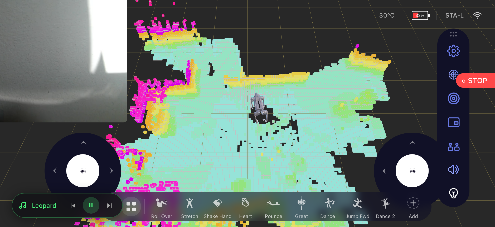

# Unitree Go2 WebRTC UI

A mobile-first control interface for the Unitree Go2 robot dog, communicating over WebRTC. Built with TypeScript, Three.js, Vite and Capacitor (iOS app).




## Features

- **Real-time 3D visualization** — Go2 model with live joint angles, lidar spinning animation, and voxel point cloud (SLAM)
- **Camera feed** — Live video with PIP view swap (camera ↔ voxel)
- **Dual joystick control** — Move and rotate the robot (hideable)
- **Action bar** — Fully customizable carousel of tricks and modes — drag to reorder, add/remove, resize icons
- **MP3 player** — Upload and play audio files on the robot speaker via `audio_server.py`
- **Floating panels** — Action bar, MP3 player, PIP window and settings bar are all freely draggable and remember their position
- **Full settings panel** — Icon size, label visibility, shortcuts management, display toggles, layout reset
- **Robot status** — Battery, motor data (temp, position, torque, lost packets), IMU, LiDAR state, network info
- **Service manager** — View all running services, start/stop with protection handling
- **Connection modes:**
  - **Local Network (STA-L)** — Direct connection via IP on same network
  - **Access Point (AP)** — Direct connection at 192.168.12.1
  - **Remote** — Cloud connection via Unitree account (email/password or token)
- **Network scanner** — UDP multicast auto-discovery of robots on the network
- **iOS native app** — Capacitor wrapper, landscape-only, background disconnect grace period (5 min)

## Repository Structure

```
src/
  connection/         # WebRTC, local/remote connectors, network scanner
  crypto/             # AES-ECB, RSA, AES-GCM for auth and SDP exchange
  platform.ts         # Capacitor vs browser detection, audio server URL helpers
  protocol/           # Data channel handler, topics, sport commands
  ui/
    components/       # Action bar, PIP camera, floating player, settings panel,
                      # side buttons, status/services/audio pages, nav bar
    scene/            # Three.js scene, robot model, voxel map
  proxy-plugin.ts     # Vite plugin: robot proxy, scanner, cloud API proxy
public/
  icons/              # Action and mode SVG icons
  sprites/            # UI sprites and backgrounds
  models/             # Go2.glb 3D model
robot/
  audio_server.py     # Flask HTTP server — runs on the robot, handles MP3 upload/play/stop/delete
ios/                  # Capacitor iOS project (Xcode)
```

## Robot Audio Server

The `robot/audio_server.py` file runs on the robot itself and exposes a simple HTTP API on port **8888**.

### Setup on robot

```bash
# Copy to robot (replace IP with your robot's IP)
scp robot/audio_server.py unitree@192.168.12.1:/home/unitree/audio_server.py

# SSH into robot and install dependencies
ssh unitree@192.168.12.1
pip3 install flask
sudo apt install ffmpeg   # or: opkg install ffmpeg

# Run the server
python3 /home/unitree/audio_server.py
```

### To start automatically on boot

```bash
# On the robot:
cat > /etc/systemd/system/audio-server.service << EOF
[Unit]
Description=Go2 Audio Server
After=network.target

[Service]
ExecStart=/usr/bin/python3 /home/unitree/audio_server.py
Restart=always
User=unitree

[Install]
WantedBy=multi-user.target
EOF

systemctl enable audio-server
systemctl start audio-server
```

### API Endpoints

| Method | Endpoint | Description |
|--------|----------|-------------|
| `GET` | `/list` | List all MP3 files |
| `POST` | `/play/<filename>` | Play a file |
| `POST` | `/stop` | Stop playback |
| `POST` | `/upload` | Upload an MP3 file |
| `DELETE` | `/delete/<filename>` | Delete a file |

## Prerequisites

- Node.js >= 18
- npm >= 9
- Unitree Go2 robot (firmware v1.1.x+)
- For iOS: Xcode 15+, Capacitor CLI

## Installation

```bash
git clone https://github.com/legion1581/unitree_go2_ui.git
cd unitree_go2_ui
npm install
```

## Usage

### Development (browser)

```bash
npm run dev
```

Open http://localhost:5173 in **Chrome** (recommended).

The dev server includes:
- Hot module replacement
- Built-in UDP multicast scanner (no separate process needed)
- Proxy for robot API and Unitree cloud API (avoids CORS)

### Production Build

```bash
npm run build
```

### iOS App

```bash
npm run build
npx cap sync ios
# Then open ios/App/App.xcworkspace in Xcode and run on device
```

## Connecting to the Robot

### Local Network (recommended)

1. Connect your phone/computer to the same network as the Go2
2. Select **Local Network** mode
3. Click **Scan** to auto-discover the robot, or enter the IP manually
4. Click **Connect**

### Access Point

1. Connect to the Go2's WiFi hotspot
2. Select **Access Point** mode (IP is auto-filled to 192.168.12.1)
3. Click **Connect**

### Remote

1. Select **Remote** mode
2. Enter the robot's serial number
3. Either enter your Unitree account email/password, or paste an access token
4. Click **Connect**

| Connection | Hub | Status | Services |
|:---:|:---:|:---:|:---:|
|  |  |  |  |

## Sport Commands (API IDs)

Actions and modes use the MCF sport API IDs matching firmware v1.1.11:

| Action | ID | Mode | ID |
|--------|----|------|----|
| Roll Over | 1021 | Damping | 1001 |
| Stretch | 1017 | Free Walk | 2045 |
| Shake Hand | 1016 | Sit Down | 1009 |
| Heart | 1036 | Crouch | 1005 |
| Pounce | 1032 | Run | 1011 |
| Jump Forward | 1031 | Walk Stair | 1049 |
| Greet | 1029 | Lock On | 1004 |
| Dance 1 | 1022 | Static Walk | 1061 |
| Dance 2 | 1023 | Endurance | 1035 |
| Front Flip | 1030 | Leash | 2056 |
| Back Flip | 2043 | Hand Stand | 2044 |
| Left Flip | 2041 | Free Avoid | 2048 |
| | | Bound | 2046 |
| | | Jump | 2047 |
| | | Stand | 1006 |
| | | Cross Step | 2051 |

## License

MIT
